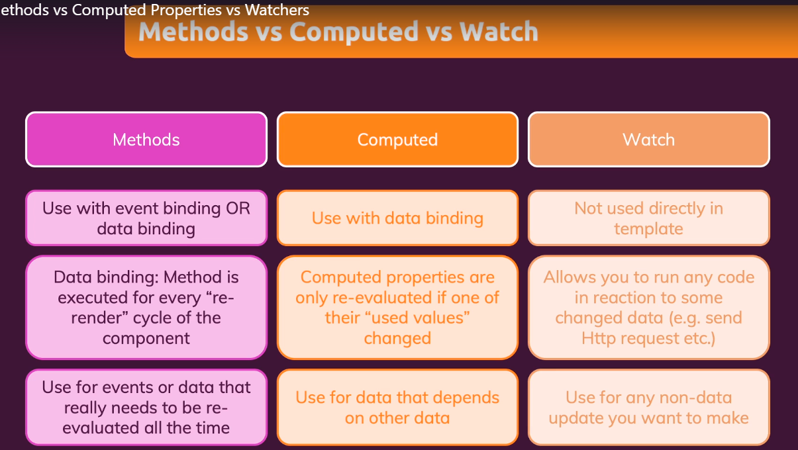

### [Vue learning course](https://fpt-software.udemy.com/course/vuejs-2-the-complete-guide)

# Summary key

### Lesson 1

#### data

```javascript
{
  data() {
    return {
      var: "value"
    }
  }
}
```

#### methods

```javascript
{
  methods: {
    showFullName() {
      return this.firstName + this.lastName
    }
  }
}
```

#### v-bind

```html
<input v-bind:value="var" />
```

#### v-html

```html
<div v-html="<b>important</b>"></div>
```

### Lesson 2

#### v-on

```html
<form v-on:submit.default="method"></form>
<input v-on:input="onInput" v-on:keyup.enter="onEnter" />
<button v-on:click.left="onLeftClick"></button>
```

#### v-once

```html
<div v-once>{{ showFullName() }}</div>
```

### Lesson 3

#### v-model

```html
<input v-model="var" />
```

#### computed

```html
<div>{{ fullName }}</div>
```

```javascript
{
  computed: {
    fullName() {
      return this.firstName + this.lastName
    }
  }
}
```

#### watch

```javascript
{
  data() {
    return {
      firstName: "Jon",
      lastName: "Doe",
      fullName: ""
    }
  },
  watch: {
    firstName(value) {
      this.fullName = value + this.lastName
    }
  }
}
```

#### Methods vs Computed vs Watch



#### v-on and v-bind shorthands

```html
<input :value="value" @input="onInput" />
```

### Lesson 4

#### Styling

```html
<div :style="{ backgroundColor: 'red', 'margin-top': '10px' }"></div>
```

#### Classes

```javascript
computed: {
  classes() {
    return ["default", { active: this.isActive, error: this.isError }]
  }
}
```

```html
<div :class="classes"></div>
```
